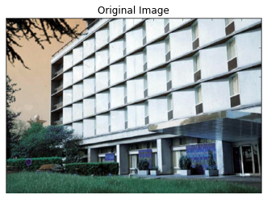
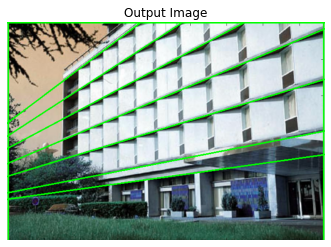
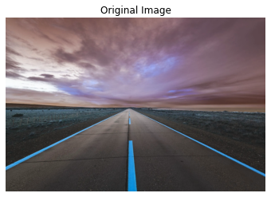
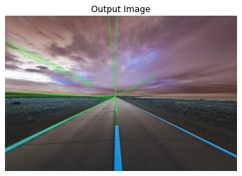
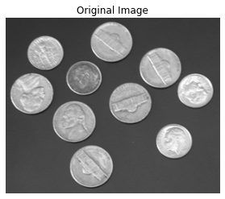
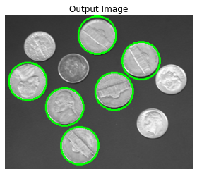

```python
import math
import cv2
import numpy as np
import matplotlib.pyplot as plt
import matplotlib.image as mpimg
import random
from scipy import signal
from PIL import Image
```


```python
def hough_peaks(H, num_peaks, nhood_size=3):

    # loop through number of peaks to identify
    indices = []
    H1 = np.copy(H)
    for i in range(num_peaks):
        idx = np.argmax(H1)  # find argmax in flattened array
        H1_idx = np.unravel_index(idx, H1.shape)  # remap to shape of H
        indices.append(H1_idx)

        # surpass indices in neighborhood
        idx_y, idx_x = H1_idx  # first separate x, y indexes from argmax(H)
        # if idx_x is too close to the edges choose appropriate values
        if (idx_x - (nhood_size / 2)) < 0:
            min_x = 0
        else:
            min_x = idx_x - (nhood_size / 2)
        if (idx_x + (nhood_size / 2) + 1) > H.shape[1]:
            max_x = H.shape[1]
        else:
            max_x = idx_x + (nhood_size / 2) + 1

        # if idx_y is too close to the edges choose appropriate values
        if (idx_y - (nhood_size / 2)) < 0:
            min_y = 0
        else:
            min_y = idx_y - (nhood_size / 2)
        if (idx_y + (nhood_size / 2) + 1) > H.shape[0]:
            max_y = H.shape[0]
        else:
            max_y = idx_y + (nhood_size / 2) + 1

        # bound each index by the neighborhood size and set all values to 0
        for x in range(int(min_x), int(max_x)):
            for y in range(int(min_y), int(max_y)):
                # remove neighborhoods in H1
                H1[y, x] = 0

                # highlight peaks in original H
                if x == min_x or x == (max_x - 1):
                    H[y, x] = 255
                if y == min_y or y == (max_y - 1):
                    H[y, x] = 255

    # return the indices and the original Hough space with selected points
    return indices, H
```


```python
def hough_lines_draw(img, indices, rhos, thetas):
  
    for i in range(len(indices)):
        # reverse engineer lines from rhos and thetas
        rho = rhos[indices[i][0]]
        theta = thetas[indices[i][1]]
        a = np.cos(theta)
        b = np.sin(theta)
        x0 = a * rho
        y0 = b * rho
        # these are then scaled so that the lines go off the edges of the image
        x1 = int(x0 + 1000 * (-b))
        y1 = int(y0 + 1000 * (a))
        x2 = int(x0 - 1000 * (-b))
        y2 = int(y0 - 1000 * (a))

        cv2.line(img, (x1, y1), (x2, y2), (0, 255, 0), 2)
```


```python
def line_detection(source: np.ndarray):
  
    img = cv2.cvtColor(source, cv2.COLOR_BGR2GRAY)
    img = cv2.GaussianBlur(img, (5, 5), 1.5)
    img = cv2.Canny(img, 100, 200)

    # Rho and Theta ranges
    thetas = np.deg2rad(np.arange(-90.0, 90.0))
    width, height = img.shape
    diag_len = math.ceil(np.sqrt(np.square(width) + np.square(height)))  # max_dist
    rhos = np.linspace(-diag_len, diag_len, diag_len * 2)

    # Cache some resuable values
    cos_t = np.cos(thetas)
    sin_t = np.sin(thetas)
    num_thetas = len(thetas)

    # Hough accumulator array of theta vs rho
    accumulator = np.zeros((2 * diag_len, num_thetas), dtype=np.uint64)
    y_idxs, x_idxs = np.nonzero(img)  # (row, col) indexes to edges

    # Vote in the hough accumulator
    for i in range(len(x_idxs)):
        x = x_idxs[i]
        y = y_idxs[i]

        for t_idx in range(num_thetas):
            # Calculate rho. diag_len is added for a positive index
            rho = int(round(x * cos_t[t_idx] + y * sin_t[t_idx]) + diag_len)
            accumulator[rho, t_idx] += 1

    return accumulator, rhos, thetas
```


```python
def hough_lines(source: np.ndarray, num_peaks: int = 10) -> np.ndarray:
   
    src = np.copy(source)
    H, rhos, thetas = line_detection(src)
    indicies, H = hough_peaks(H, num_peaks, nhood_size=20)  # find peaks
    hough_lines_draw(src, indicies, rhos, thetas)

    return src
```


```python
def detectCircles(img, threshold, region, radius=None):
   
    img = cv2.cvtColor(img, cv2.COLOR_BGR2GRAY)
    img = cv2.GaussianBlur(img, (5, 5), 1.5)
    img = cv2.Canny(img, 100, 200)
    (M, N) = img.shape
    if radius == None:
        R_max = np.max((M, N))
        R_min = 3
    else:
        [R_max, R_min] = radius

    R = R_max - R_min
    # Initializing accumulator array.
    # Accumulator array is a 3 dimensional array with the dimensions representing
    # the radius, X coordinate and Y coordinate resectively.
    # Also appending a padding of 2 times R_max to overcome the problems of overflow
    A = np.zeros((R_max, M + 2 * R_max, N + 2 * R_max))
    B = np.zeros((R_max, M + 2 * R_max, N + 2 * R_max))

    # Precomputing all angles to increase the speed of the algorithm
    theta = np.arange(0, 360) * np.pi / 180
    edges = np.argwhere(img[:, :])  # Extracting all edge coordinates
    for val in range(R):
        r = R_min + val
        # Creating a Circle Blueprint
        bprint = np.zeros((2 * (r + 1), 2 * (r + 1)))
        (m, n) = (r + 1, r + 1)  # Finding out the center of the blueprint
        for angle in theta:
            x = int(np.round(r * np.cos(angle)))
            y = int(np.round(r * np.sin(angle)))
            bprint[m + x, n + y] = 1
        constant = np.argwhere(bprint).shape[0]
        for x, y in edges:  # For each edge coordinates
            # Centering the blueprint circle over the edges
            # and updating the accumulator array
            X = [x - m + R_max, x + m + R_max]  # Computing the extreme X values
            Y = [y - n + R_max, y + n + R_max]  # Computing the extreme Y values
            A[r, X[0]:X[1], Y[0]:Y[1]] += bprint
        A[r][A[r] < threshold * constant / r] = 0

    for r, x, y in np.argwhere(A):
        temp = A[r - region:r + region, x - region:x + region, y - region:y + region]
        try:
            p, a, b = np.unravel_index(np.argmax(temp), temp.shape)
        except:
            continue
        B[r + (p - region), x + (a - region), y + (b - region)] = 1

    return B[:, R_max:-R_max, R_max:-R_max]
```


```python
def displayCircles(A, img):
    
    circleCoordinates = np.argwhere(A)  # Extracting the circle information
    for r, x, y in circleCoordinates:
        cv2.circle(img, (y, x), r, color=(0, 255, 0), thickness=2)
    return img
```


```python
def hough_circles(source: np.ndarray, min_radius: int = 20, max_radius: int = 50) -> np.ndarray:
    src = np.copy(source)
    circles = detectCircles(src, threshold=8, region=15, radius=[max_radius, min_radius])
    return displayCircles(circles, src)
```


```python
#  Parameters Values 
min_radius = 30
max_radius = 50
num_votes = 10 
```


```python
#For the lines Part
hough_input_image = cv2.imread('lines1.png')
#display the input
arr = np.asarray(hough_input_image)
plt.imshow(arr)
plt.axis('off')
plt.title("Original Image")

```


    Text(0.5, 1.0, 'Original Image')


    

    


```python
#lines
hough_output_img = hough_lines(hough_input_image, num_peaks=num_votes)
# Display output
arr = np.asarray(hough_output_img)
plt.imshow(arr)#, cmap='gray')
plt.axis('off')
plt.title("Output Image")
```


    Text(0.5, 1.0, 'Output Image')


    

    


```python
#For the lines Part
hough_input_image = cv2.imread('lines3.png')
#display the input
arr = np.asarray(hough_input_image)
plt.imshow(arr)
plt.axis('off')
plt.title("Original Image")
```


    Text(0.5, 1.0, 'Original Image')


    

    


```python
#lines
hough_output_img = hough_lines(hough_input_image, num_peaks=num_votes)
# Display output
arr = np.asarray(hough_output_img)
plt.imshow(arr)#, cmap='gray')
plt.axis('off')
plt.title("Output Image")
```


    Text(0.5, 1.0, 'Output Image')


    

    


```python

```


```python

```


```python
#For the circles part 
hough_input_image = cv2.imread('C2.png')
#display the input
arr = np.asarray(hough_input_image)
plt.imshow(arr)
plt.axis('off')
plt.title("Original Image")
```


    Text(0.5, 1.0, 'Original Image')


    

    


```python
#detect circles
hough_output_img = hough_circles(hough_input_image, min_radius=min_radius,max_radius=max_radius)
# Display output
arr = np.asarray(hough_output_img)
plt.imshow(arr)#, cmap='gray')
plt.axis('off')
plt.title("Output Image")
```


    Text(0.5, 1.0, 'Output Image')


    

    


```python

```


```python

```
